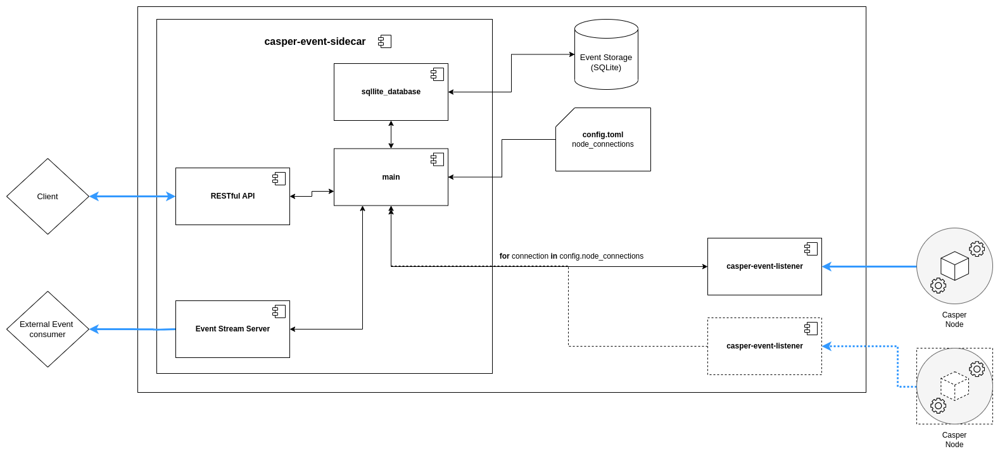

# Sidecar in Casper 2.0

The Casper Sidecar is a standalone application which runs the JSON-RPC service formerly provided as part of the Node itself. This replaces the JSON RPC formerly found on the Casper Node, and extends its the capabilities. By acting as an middleman between Casper nodes and clients applications, it enhances network performance, scalability and flexibility.

## Key Components

The Sidecar's primary components:

1.  **SSE (Server-Sent Events) Server:** Mirroring the node's SSE feed, the Sidecar allows clients to access real-time events without directly interacting with the node. It also stores events in a database for historical analysis and retrieval.

2.  **RPC JSON API Server:** This addresses the removal of the JSON-RPC API from Casper nodes (Only the binary RPC will be available in Casper 2.0 nodes) by offering JSON-based RPC interface. This is essential for developers who rely on JSON-RPC.  A key advantage of this server is its ability to be updated independently of the Casper node software, allowing for rapid development and bug fixes without network downtime.  

**Important Note:**
>  Sidecar can connect to multiple nodes for the SSE feed, consolidating events from various sources into one stream. However, it connects only to a single node for RPC API requests

## Implications for Developers

The removal of the JSON-RPC API from Casper nodes introduces change in how developers interact with the network. They have several options:

1.  **Connect to Nodes Running Sidecar:** Developers can directly connect their applications to Casper nodes that are also running the Sidecar. In this scenario, the experience remains largely unchanged, as the Sidecar provides the familiar JSON-RPC interface. This is the most convenient option if available nodes are running the Sidecar.

2.  **Run a Sidecar Instance:** If the desired node isn't running the Sidecar, developers can choose to run their own Sidecar instance alongside their application. This provides the flexibility to fine tune the Sidecar configuration to the specific needs. 

3.  **Utilize SDKs with Binary Port Connectivity:** For those seeking a more direct connection and potentially bypassing the Sidecar altogether, SDKs capable of communicating with the node's binary port are a viable alternative.

**Important Note:**
> The choice between these options depends on individual preferences, project requirements, and the availability of Sidecar-enabled nodes. Developers should carefully evaluate each approach to determine the best choice for their specific use case.

## Decoupling for Performance
By separating the JSON-RPC API from the core node infrastructure and handling serialization/deserialization within the Sidecar, the node performance is significantly enhanced. This allows nodes to focus on core functions like block validation and consensus, resulting in a faster and more efficient Casper Network. Additionally, this decoupling enables easier updates to the JSON-RPC and the Sidecar as a whole.

## Summary

The Casper 2.0 Sidecar represents a significant architectural change. By decoupling key functionalities from the node, it enhances performance, scalability, and flexibility of the network.

### Resources

* [Sidecar Repository](https://github.com/casper-network/casper-sidecar)
* [Sidecar Usage Guide](https://github.com/casper-network/casper-sidecar/blob/dev/USAGE.md)
* [Sidecar Docker Image](docker image link)
